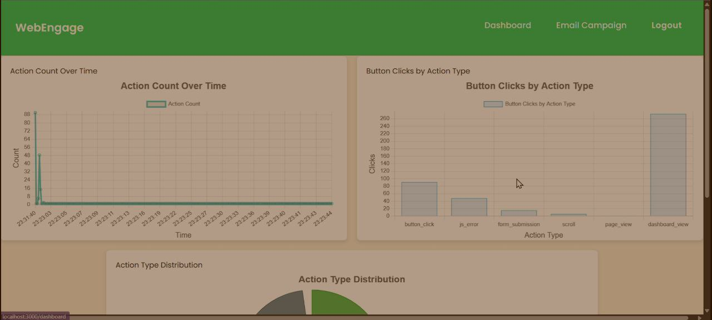

# WebEngage - Web Analytics Platform (MERN Stack)

WebEngage is a web analytics platform built using the MERN stack that helps developers and businesses monitor user interactions on their websites. This tool captures events like button clicks, form submissions, page scrolls, JS errors, and dashboard views — providing actionable insights to improve UX and performance.

## 🧠 Problem Statement

Modern websites lack an easy way to track how users interact with elements in real-time. Developers and businesses need a flexible solution to capture events like clicks, scrolls, and form submissions to analyze behavior and improve decision-making.

## 🚀 Features

- 📊 Action tracking: `button_click`, `form_submission`, `scroll`, `js_error`, `page_view`, `dashboard_view`
- 📦 Custom JS SDK for integrating with any website
- 📈 Real-time dashboard with graphs and charts
- 🔍 Insightful metrics: Total actions, unique actions, click counts
- 🧰 REST APIs for flexible data retrieval
- 🛡️ Built with security and performance in mind

## 📸 Screenshots

### Dashboard with Action Count & Event Type Analysis  

### Action Type Distribution and Summary Metrics  

## 🛠️ Tech Stack

- **Frontend**: React.js, Chart.js  
- **Backend**: Node.js, Express.js  
- **Database**: MongoDB  
- **Others**: JavaScript SDK, REST APIs, JWT Auth
